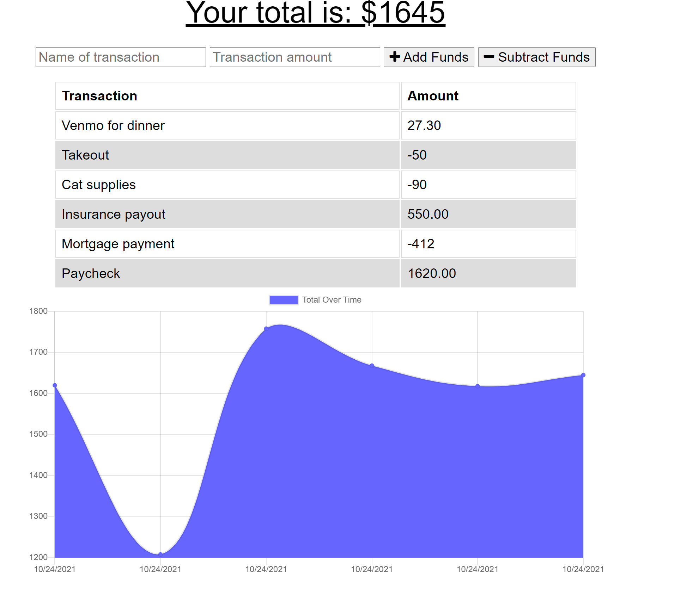

# budget-it

A simple budget-tracking web browser app.

## Contributors
Katharine C Humble

## Technologies used:
- HTML, CSS
- Javascript
- Node: Express.js, mongoose.js
- MongoDB

## Installation and use instructions
No installation necessary, the application runs in the web browser.
To download, beginning by cloning source code.  Ensure that MongoDB is installed and running on your machine.  If not, please download and install MongoDB.
To use, in the response fields, enter the name of the debit or credit (i.e. paycheck, housing payment, etc) and the amount, then select "Add" or "Subtract" to subtract the amount from the total budget.  A graph will track the funds for the user and persist through caching when the user navigates away from the app.  Users can add and subtract funds from their budget even when online service is disrupted.

## Links
- [GitHub (source code)](https://github.com/katharinechumble/budget-it)
- [Live app](https://dashboard.heroku.com/apps/enigmatic-beyond-02512/deploy/github)

## Contact me at
- [GitHub](https://github.com/katharinechumble)
- [Email](mailto:katharinechumble@gmail.com)

## Demo
